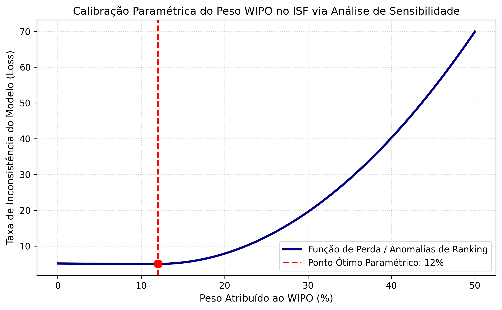
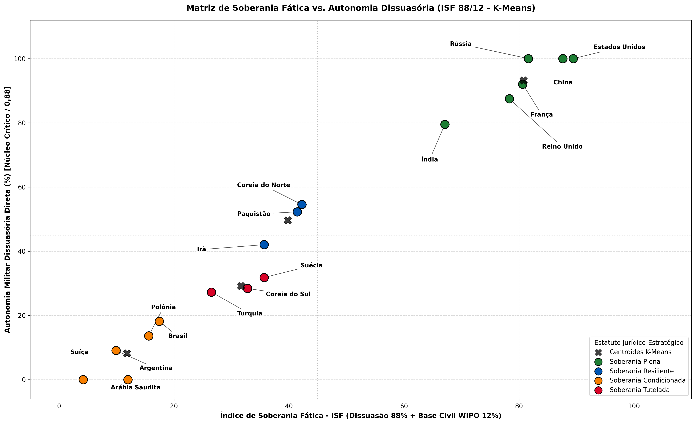
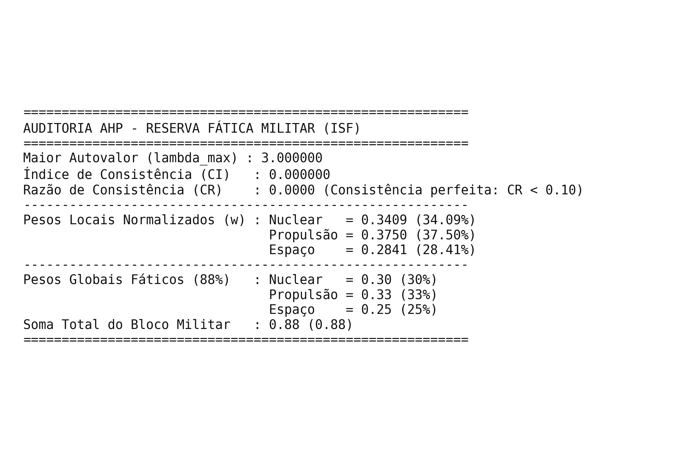

# Índice de Soberania Fática (ISF) - Dados e Modelos Computacionais

Este repositório reúne os conjuntos de dados, scripts de calibração paramétrica, modelos multicritério e algoritmos de aprendizado de máquina não supervisionado desenvolvidos no âmbito da dissertação de mestrado apresentada ao Programa de Pós-Graduação em Direito da Universidade Estácio de Sá (PPGD/UNESA).

---

## 1. Estrutura dos Modelos Empíricos

O arcabouço computacional operacionaliza a mensuração da soberania em termos fáticos e materiais, estruturando-se em três etapas algorítmicas principais:

1. **Calibração Paramétrica da Base de Inovação Civil (WIPO):** Análise de sensibilidade (*Grid Search*) para determinar a fronteira ótima de ponderação entre o núcleo militar dissuasório (88%) e a base tecnológica civil (12%).
2. **Partição da Reserva Militar via Processo de Hierarquia Analítica (AHP):** Modelagem pareada recíproca fundamentada na psicofísica de Thomas Saaty e nas Leis de Weber-Fechner para dedução axiomática dos pesos fáticos: Propulsão/Soberania Lógica ($0{,}33$), Dissuasão Nuclear ($0{,}30$) e Espaço/Alcance Cinético ($0{,}25$), com consistência algébrica estrita ($\text{CR} = 0{,}0000$).
3. **Clusterização de Estatutos Estratégicos (K-Means):** Agrupamento não supervisionado ancorado por baricentros ontológicos para classificação de 17 Estados da amostra internacional ($k=4$).

---

## 2. Visualizações dos Resultados

### Figura 1: Calibração Paramétrica do Peso WIPO via Análise de Sensibilidade
Determinação do ponto crítico de estabilidade paramétrica ($12\%$) para a base WIPO, prevenindo anomalias de ordenamento no núcleo militar.



* **Script correspondente:** `grafico1_sensibilidade_wipo.py`

---

### Figura 2: Matriz de Soberania Fática vs. Autonomia Dissuasória (ISF 88/12)
Partição em quatro clusters (*Soberania Plena*, *Soberania Resiliente*, *Soberania Tutelada* e *Soberania Condicionada*) via algoritmo K-Means ($k=4$).



* **Script correspondente:** `grafico2_matriz_isf_kmeans.py`

---

### Tabela 3: Auditoria Matricial AHP da Reserva Fática Militar (Perron-Frobenius)
Relatório formal de consistência algébrica, autovetor principal normalizado e pesos derivados sobre os 88 pontos da reserva dissuasória.



* **Script correspondente:** `script_03_ahp_pesos_faticos.py`

---

## 3. Especificação Metodológica das Variáveis

* **Propulsão Nobre de Turbinas e Soberania Lógica ($X_1$ - Peso: 0,33):** Domínio fabril de turbofans de alta potência (superligas monocristalinas) e faculdade plena de compilação, auditoria e execução irrestrita do código-fonte de tiro e aviônica (imunidade a regimes extraterritoriais como o ITAR e a *kill-switches*).
* **Dissuasão Nuclear / Segundo Ataque ($X_2$ - Peso: 0,30):** Mensuração da capacidade de sobrevivência existencial sob retaliação garantida (*second-strike capability*) e controle pleno do ciclo isotópico de enriquecimento de combustível.
* **Espaço, Vetores Balísticos Orbitais e Sensoriamento Autônomo ($X_3$ - Peso: 0,25):** Capacidade autóctone de lançamento espacial de mísseis estratégicos e independência de sinais de constelações orbitais PNT (Posicionamento, Navegação e Tempo).
* **Escore WIPO Normalizado (Peso: 0,12):** Volume e densidade de patentes residentes via normalização Min-Max, delimitado como teto máximo de inovação civil para blindagem da consistência soberana.

---

## 4. Como Citar

### Referência Bibliográfica (ABNT NBR 6023)

OLIVEIRA, Guilherme Fontenelle Ribeiro de. **Repositório Institucional de Dados e Códigos: Índice de Soberania Fática (ISF)**. Rio de Janeiro: Universidade Estácio de Sá (PPGD/UNESA), 2026. Disponível em: https://github.com/guilherme68-linux/dissertacao-mestrado-soberania-isf. Acesso em: 6 set. 2026.

### Entrada BibTeX

```bibtex
@misc{oliveira2026isf,
  author       = {Oliveira, Guilherme Fontenelle Ribeiro de},
  title        = {Reposit{\'o}rio Institucional de Dados e C{\'o}digos: {\'I}ndice de Soberania F{\'a}tica (ISF)},
  year         = {2026},
  publisher    = {GitHub},
  journal      = {GitHub repository},
  howpublished = {\url{[https://github.com/guilherme68-linux/dissertacao-mestrado-soberania-isf](https://github.com/guilherme68-linux/dissertacao-mestrado-soberania-isf)}},
  institution  = {Programa de P{\'o}s-Gradua{\c{c}}{\~a}o em Direito, Universidade Est{\'a}cio de S{\'a} (PPGD/UNESA)},
  address      = {Rio de Janeiro, Brasil},
  note         = {Acesso em: 6 set. 2026}
}
